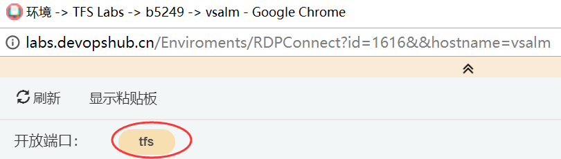

Lab version:15.4

Last updated:12/5/2017

## 概述

在这个实验中，你将学习使用Team Foundation Server 2018提供的关于敏捷计划，项目流程管理来帮助你快速的制定团队计划，管理和追踪相关工作进度。你将学习如何使用积压工作列表，迭代看板和任务版来跟踪迭代中的工作流。我们还将了解这些工具是如何在这个版本中得到增强的，以针对更大的团队和组织。

## 前提

为了完成这个实验你需要微软提供的Visual Studio 2017虚拟机

**注意事项**:

在您针对TFS中的工作项或代码进行任何修改之前，请确保您的虚拟机处于默认状态。

## 关于 Fabrikam Fiber 

这组实验使用了一个虚构的公司Fabrikam Fiber作为学习的背景。Fabrikam Fiber 公司为美国提供有线电视和相关服务。公司正在迅速成长，并已经使用了Windows Azure为用户网站提供快速扩容服务，以便满足用户的自助化服务请求和对技术人员工作的跟踪。他们也使用一个本地部署的ASP.NET MVC应用为客户服务代表管理客户订单。

## 练习 1: 敏捷项目管理

在这个练习中，您将学习如何使用Team Foundation Server 2018来管理您的积压工作列表，创建工作项，将工作项分解为任务，将任务分配给团队成员，并使用任务板跟踪进度。这个概述将展示中小型开发团队用于产品开发可以利用的基本项目管理工具。

> **注意:** 在这个实验中使用的团队项目使用Scrum过程模板，但是核心特性演示适用于所有过程模板。

### 任务 1: Team Foundation Server Web 入口

1. 登陆用户名 **Sachin Raj (VSALM\Sachin)**. 所有密码都是 **P2ssw0rd**。

    > **注意:** 为了充分演示这个实验的ALM特性，我们首先将虚拟机设置为一个特定的日期，该日期与预先配置的、正在进行的迭代进行组合排列。这个实验需要使用原始的虚拟机状态（不需要对源或工作项进行任何修改），否则将报错。

1. **右击** 桌面的 **ConfigureALMDemo.bat** 文件以 **管理员**身份运行，这个脚本将设置虚拟机的初始时间和实验环境一致。

1. 打开任务栏的 **Internet Explorer** ，点击收藏夹的 **TFS FF Portal** 。

    

1. 从门户左上角的下拉框中选择 **Browse all** 选项。

    

1. 新的界面显示，Fabrikam Fiber 的集合有一个项目，叫做 **FabrikamFiber** 。这个项目包含了几个不同的团队，**Fabrikam Fiber Leadership Team** 被设置为项目的默认团队。我们将在以后的练习中更详细的了解团队。请注意，这个实验将这个默认的团队称为leadership team和management team。您可以轻松地访问特定用户的查询，并且可以通过点击该行快速跳转到任何团队。

    

1. 选择 **Fabrikam Fiber Web Team** 然后点击。

    

1. Fabrikam Fiber Web团队的 **Home** 界面提供了当前迭代（Sprint 3）的高级概述，包括相对于团队容量的工作负载、任务燃尽图以及其他团队关心的内容，其中包括可配置的工作项查询、构建定义和源代码提交统计。此外，还有一些链接可以快速创建新的工作项和bug，跳转到积压工作列表，任务板，发起反馈请求等。

    

1. 正如您在 **Team Members** 部分中所看到的，在这里可以添加团队成员。团队是一个概念，最初是在Team Foundation Server 2012中引入的，目的是让管理、分配和跟踪工作变得更容易。

### 任务 2: 使用看板

1. 通过单击 **Work** 下面的 **Backlogs** 来导航到Backlog。

    

1. 借助backlog，你可以更好的管理工作优先级，以及这些工作和代码提交，验收测试以及接受标准之间的关系。

    

    > **注意:** 在这个屏幕左边的迭代树中显示的当前迭代是 Iteration 3。Team Foundation Server使用当前日期和时间来确定当前迭代。为了用于本实验，您正在使用的虚拟机已被设置为2013年7月9日。

1. 想象一下， Fabrikam Fiber的副总裁要求为面向客户的服务门户实现一个新的用户故事。这个新的用户故事将让客户提供能够看到与天气原因相关的服务中断。这个用户故事被指定为高优先级，因为许多客户需要它，而客户服务人员也认为这将大大减少在停机期间的电话支持数量。

1. 选择积压工作项的最后一行，然后创建一个新的积压工作项，标题为 **Customer should see weather-related outages on portal.**

    

    > **注意:** 新的工作项通常被插入到选定的位置之上。唯一的例外是，如果您选择了最后一个工作项，那么插入将在选定的位置之后。

1. 点击 **Add** 添加一个新的用户故事到backlog。

    

1. 积压工作项列表上的工作项是根据优先级排序的，我们的新工作项有很高的优先级，所以将它拖放到列表的顶部位置。

    

1. 让我们编辑这个用户故事，将其分配给相关人员，并记录预期工作的初始估计。

    

1. 工作项表单上包括了工作项所包含的所有细节的完整展示。这个表单提供了响应式布局，可以适配不同的设备屏幕。如果你希望在工作项发生变化时获得通知，可以点击 Follow 获取这些通知。注意：如果你是在手机上点开一个工作项表单，那么我们将使用移动设备布局来显示工作项。

    

1. 你也可以使用富文本来扩展你的文本字段，例如，在 **Discussion** 面板中填写 **"Customers have been asking about this forever!"** ，然后选择 **"forever"** ，并且按 **Ctrl+B** 来强调。

    

1. 您还可以将附件直接拖放到工作项上，在工作项表单的右侧选择附件选项。然后打开Windows资源管理器，**C:\Samples**，并将故事板PPTX文件拖放到附件面板上。

    

1. 返回 **Details** 选项。

    

1. 将新工作项分配给Deniz Ercoskun（Fabrikam Fiber团队的产品负责人），将状态设置为 Approved，并设置Effort值为8。点击 **Save & Close**。

    

    > **注意:** 每个团队可以选择根据他们认为合适的方式定义工作量，使用故事点、小时、天数或资源数量。这里的要点是，这个度量是相对于其他工作项的相对值。这些工作量将在后续的操作中被分解成以小时为单位的任务。

    一种流行的计划方法有助于简化团队计划复杂度，并考虑来自所有团队成员的产出，这被称为Planning poker。你可以在这里读到更多关于它的信息 [http://en.wikipedia.org/wiki/Planning_poker](http://en.wikipedia.org/wiki/Planning_poker)。

1. 将新的用户故事分配给当前的迭代，Iteration 3，通过拖放它，如下所示。

    

    > **注意:** 如果您是一个Scrum纯粹主义者，您可能会对我们在正在进行的迭代中添加新工作的事实感到很不愉快。虽然这是您在现实世界中可能永远不会做的事情，但这是为了简化工作流程而使用的一个快捷方式，我们的目的是向您展示TFS项目管理工具的各个方面。而且，这也是之前VP要求我们做的，对吧？！

1. 查看新用户故事的 **Iteration Path**，以确保它按照预期被分配到 **Iteration 3**。这个用户故事将保留在积压工作项列表中，直到工作完成。

    

1. 再次打开工作项并选择History选项。在这里，您可以看到针对这个工作项所执行的每一个操作的完整的跟踪，以及状态图，使您可以很容易地看到随时间变化内容，按Esc关闭工作项。

    

1. 如果您在添加工作项时犯了一个错误，或者由于任何原因，工作项不应该成为待办事项列表的一部分，您可以将它拖到 **Recycle Bin** 。把刚刚创建的项目拖到 **Recycle Bin** 。然后单击 **Recycle Bin** 查看其内容。

    

1. 现在它只包含你刚刚删除的条目。幸运的是，您可以右键单击该工作项并选择Restore将其还原。当被询问时，确认恢复。

    

1. 现在让我们回到backog。然而，**Recycle Bin** 没有提供直接的返回路径。幸运的是，TFS现在支持各种各样的键盘快捷键，使快速导航变得尽可能简单。按下 **"?"** 键（ **Shift+/**）可以查看所有快捷键的列表。

    

1. 积压工作项列表的快捷方式是L（小写的"L"）键，尝试一下吧。

1. 积压工作项列表视图还提供了一个迭代速率图，显示了团队在每个sprint中所承担的工作量，每个sprint将会区分正在进行中的工作和完成的工作。点击右上角的缩略图来加载更大的视图。

    

1. 在 Iteration 1中, 团队完成了35个故事点。Iteration 2的效率更高，完成了49个故事点。当前的迭代，由Iteration 3表示，显示我们目前没有任何处于提交状态的工作项。请记住，这些故事点是团队一致同意的相对度量。

    

1. 按 **Esc** 键关闭速度图。

1. 积压工作项列表可以根据所分配的日期对过去、当前和未来的迭代进行分组。单击Iteration 3，这样我们就可以分解工作并将其分配给适当的团队成员。

    

1. 在我们分解新的用户故事之前，让我们快速浏览一下这个Iteration backlog视图。首先，它显示了分配给选定迭代的所有用户故事和相关任务，无论这些工作项处于什么状态。

    

1. 一眼看去，您可以看到当前的迭代从7月1日到12日，还有4个工作日剩余。在当前迭代日期范围的右边，有一个小图显示了剩余工作的燃尽图。

    ****

1. 点击燃尽图来查看它，该图显示了在迭代过程中剩余的工作，它还可以查看应用于工作的可用容量（跨资源的总工作时间）。

    

1. 按 **Esc** 键关闭燃尽图。

### 任务 3: 团队容量规划

1. 定位到 **Work** 工具栏，它显示了我们对于当前迭代的容量，基于在这个迭代中任务的剩余工作的总数，并基于团队的总容量。看起来我们现在还好，但是我们还没有把新的用户故事分解成团队的任务。

    

1. 选择 **Capacity** 选项 来查看团队容量详细信息。

    

1. 容量视图允许我们指定每个团队成员在这个项目上工作的每天的小时数，每个团队成员的休息日，以及整个团队的休息日。这些容量设置适用于当前的迭代。您可以选择使用活动列来描述每个团队成员的专业。当任务被活动分解时，它可以为您的团队提供另一种视图，以确定是否有足够多的人处理类似文档编写这类任务以满足对迭代的需求。请不要对容量设置进行任何修改。

    

1. 回到当前迭代的 **Backlog** 视图。

    

1. 假设我们决定继续提交新的工作项。返回到 **Iteration 3** backlog视图。在新用户故事的左边点击 '**+**' 按钮，添加一个新任务，用于帮助描述完成这个用户故事所需的实现细节。

    

1. 对于这个新任务, 标题输入 "**Consume OData feed for weather alerts**" , 指派给 **Deniz Ercoskun**,设置 **Remaining Work** 为 **8** 小时。

    

1. 选择 **Links** 选项你将看到这个任务已经关联父级工作项。

    

1. 点击 **Save & Close**.

    

1. 注意，新任务是作为用户故事的子任务添加的，并且整个团队工作栏已经变成红色，这表明根据我们的团队容量设置，现在分配了过多的工作。

    

1. 看起来还没有人开始处理这个bug，所以这可能是一个很好的候选者，可以被重新安排到未来的迭代，这样团队就可以从超负荷状态回到正轨。让我们将bug拖放到窗口左边的Iteration 4中。

    

1. 再看一遍 **Work** 工具栏，确保它是绿色的。这意味着我们在当前的团队能力范围内。只是不要告诉副总裁，否则他可能会找到另一个高优先级的需求，让我们继续工作！

    

### 任务 4: 使用任务版

1. 现在，我们已经完成了工作，并将其分配给团队成员，让我们来看看在接下来的站立会议中使用的任务板，用来报告和记录进度。从 **Iteration 3** 中选择 **Board** 选项卡。

    

1. 在默认情况下，任务板显示当前迭代的所有任务，这些任务是按照积压工作项列表和当前状态分组的。将 "Consume OData feed for weather alerts" 任务拖放到In Progress栏中。

    

    > **注意:** 任务板中提供拖拽功能，你可以考虑为团队添置一个带触摸功能的壁挂平板电视了。

1. 单击 **Consume OData feed for weather alerts** 任务的 **'8'** 然后修改 **remaining work** 为 **'5'** ，以模拟在白天工作的Brian。

    

1. 新的高优先级任务现在正在进行中，估计还有5个小时的工作要完成。

    

1. 将名为 **Create database for branch office location lookup** 的任务拖放到 **Done** 的列上，以将该工作记录为已完成的工作。注意，**remaining work** 将自动减少为0。

    

1. 注意，每一行的最左侧的工作项的上显示了剩余的工作时间的汇总。另外，状态栏的每一列也显示所有子任务的剩余工作的总和。这让您很好地了解了团队目前正在进行的工作。

    

1. 关闭燃尽图。

1. 注意，代表工作项的每一行显示了剩余的工作时间的汇总，另外，状态栏的每一列也显示所有子任务的剩余工作的总和。这让您很好地了解了团队目前正在进行的工作。

    

1. 任务板也可以按照团队成员分组，在task board视图的右上方选择 **People** 分组选项。

    

1. 这个视图使得我们可以很容易地看到团队成员当前正在进行的工作，以及在当前迭代的剩余时间里，每个成员的工作量是多少。

    

### 任务 5: 使用工作项查询

1. 通过工作项搜索，您可以快速轻松地在一个帐户中找到所有项目的相关工作项。点击页面顶部的搜索框，以扩展搜索帮助。请注意，您可以为诸如state和内联类型之类的属性指定过滤器。

    

1. 查询 **customer**。

    

1. 这个通用查询将会有许多结果，您可以使用左边的选项来过滤您正在寻找的工作项，您还可以使用右边的表单编辑所选的工作项。

    

1. 将“t：Task”附加到查询的末尾，并按Enter键过滤到任务。

    

1. 附加另一个内联过滤器“s:To Do”，然后按Enter键过滤到带有该状态的任务。

    

1. 附加“a：Clemri”，以通过分配来过滤。TFS将在一个下拉列表中提供Clemri的帐户，单击它以自动完成查询。
    

1. 将会插入Clemri用户的完整路径，按Enter键来运行搜索。

    

1. 除了在工作项中进行搜索之外，您还可以在Code hub中使用相同的过程搜索代码。

## 练习 2: 敏捷项目集合管理

在这个练习中，您将了解到Team Foundation Server提供的一些敏捷项目集合管理功能。这些功能允许更大的组织跨多个团队的工作，并了解如何将工作转化为更庞大的计划。在这个练习中，您将探索如何在 Fabrikam Fiber 中进行多个团队协作。

### 任务 1: 配置团队组织结构和区域

1. 让我们从上到下看一下 Fabrikam Fiber 项目，这种方式通常与管理角色相关。

1. 从web门户右上角的齿轮图标，选择 **Project settings**。

    

1. FabrikamFiber 项目有5个团队，**Fabrikam Fiber Leadership Team** 为项目默认团队。

    

1. 在Work选项卡下面，选择 **Areas** 选项卡。

    

1. Management team目前拥有 **Development** 区域和所有子区域。这使他们能够看到所有团队的backlog，甚至是那些没有映射到特性的工作项。此外，Management team还可以选择不包括子区域，如果是这样一旦工作项被分配给其中一个团队，就会从他们的积压工作项列表消失。

    

1. 从左上角的团队下拉，选择 **Fabrikam Fiber Database Team**。

    

1. 选择 **Areas** 选项卡。 **Database** 团队目前被配置为仅仅从 **Development** 和 **Database Team** 子区域查看工作项。这使他们能够看到Management Team创建的积压工作项列表，以及专门分配给他们团队的项目。有了这种结构，每个团队都可以独立地在自己的待办事项列表中独立工作，这是由其区域路径定义的，与其他团队的工作无关。

    

1. 从项目下拉，选择 **Fabrikam Fiber Leadership Team** 。

    

1. 返回leandership team可见的backlog

    

1. 选择 **Backlog items** 选项。

    

### Task 2: Portfolio Management

1. 领导团队可以在所有团队中看到积压工作项列表，包括状态和迭代。

    

1. 积压工作项列表还包括切换正在进行的工作项显示的功能。在backlog视图的右上角切换 **In progress items**，并注意Committed的工作项不再显示。在继续之前，再次切换查看正在进行的工作项。

    

1. 注意，正在进行的工作项不再显示。再次切换，以查看正在进行的项目。

1. 点击 **Features** 来查看 feature backlog.

    

1. 这个视图显示了项目的顶级特性。如果需要的话，可以深入到积压工作项列表中，甚至是单独的任务，单击Expand按钮以展开一个级别。

    

1. 点击 **Expand** 按钮 深入到任务工作项。

    

1. 项目组合管理视图支持使用拖放操作来重新安排工作项。通过将一个工作项拖放至另外一个工作项下面作为子级。

    

1. 注意，移动的积压工作项以及所有的子任务，将积压工作项拖回原来的特性。

1. 不管他们被分配到哪个团队，子集的工作项总是显示在领导团队中。为了更清楚地看到这一点，让我们将区域路径列添加到视图列中。

1. 点击 **Column Options**.

    

1. 双击 **Area Path** 然后点击 **OK**.

    

    

1. 注意每个积压工作项的区域路径字段的值，你可以发现他们被分配到了不同的团队中。这种自上而下的钻取能力给予了管理团队了解工作分解和特性实施过程的能力。

    

1. 现在，让我们看一看如何创建一个新特性，然后将其链接到一个工作项，该工作项将被分配给一个敏捷团队。创建一个名为 **"Reporting for technicians and services"** 的新功能，然后单击Add按钮。

    

1. 点击新特新左边的 **"+"** 按钮添加一个子积压工作项。

    

1. 创建一个叫 **"Modify databases to support on-demand reporting for technician activity"** 的新积压工作项，分派给数据库团队lead  **Deniz Ercoskun**，设置 **Area**  **Database Team**  显示在他们的看板中。最后， 点击 **Save & Close**。

    

    > **注意:** 如果您在积压工作项列表中创建项目，您还可以通过启用映射特性，然后拖放，轻松地将它们映射到父级的特性。

    

1. 现在让我们为数据库团队加载web门户。使用顶部导航导航到 **Fabrikam Fiber Database Team** 。

1. 切换到backlog工作项视图。

    

1. 尽管这个团队通常只希望查看他们的积压工作项，但是他们可能也想知道这些积压工作项的父级，切换当前设置为 **Hide** 的父级选项。

    

1. 注意，backlog视图现在显示了父级的特性项。

    

   **注意**：完成这个实验后，你的虚拟机将继续所设置的时间。请记得重置虚拟机的状态。

