Last updated : {{ "now" | date: "%b %d, %Y" }}.

## 概述

[发布管理](https://www.visualstudio.com/en-us/docs/release/overview/) 是Visual Studio 团队服务中的一项服务，可帮助您在多个环境中自动部署和测试您的软件。使用发布管理，您可以完全自动化将软件交付到生产环境，或者通过人工审核和按需部署来设置半自动化流程。这是DevOps的一个重要组成部分，可帮助您的团队以更快的速度和更低的风险持续地向客户交付软件。

发布管理可供软件开发人员用于持续自动化部署，或者是在大型企业中，用于提升参与发布过程的各团队间的效率和协作。

要使用发布管理，您可以创建发布定义，在其中指定应在每个环境中运行的自动化任务。这些自动化任务可以部署您的软件并运行测试任务。您可以将每个定义中的多个环境分组来模拟软件生命周期。然后，您可以在每个环境中设置部署，以便在构建完成后，在特定时间或成功部署前置环境时自动触发。

## 先决条件

为了完成这个实验，你需要 - 

- **Visual Studio 团队服务帐户**。如果你没有，你可以从这里 [创建](https://www.visualstudio.com/) 

- **Visual Studio 2017**或更高版本

- 您可以使用**[VSTS演示数据生成器](http://vstsdemogenerator.azurewebsites.net/Environment/Create)**向您的Visual Studio 团队服务帐户提供预定义数据的项目。请使用*** My Health Clinic***模板来关注动手实验室。

- 如果您未使用VSTS Demo 生成器，则可以从这里克隆代码

## 练习1: 连接到Microsoft Azure

1. 登录到您的Visual Studio 团队服务帐户。

1. 在您的账户概览页面中，选择您的团队项目。要找到您的团队项目，也可以使用搜索功能。

    

1. 选择**齿轮图标**打开管理控制面板。

     

1. 转到**服务**，然后单击**新服务端点**添加一个。

     

1. 从下拉菜单中选择**Azure资源管理器**。

   

1. 提供连接名称**MHC-Azure**并选择订阅。

    

## 练习2: 创建发布定义

1. 从您的VSTS帐户转到您的**Release**选项卡。

    

1. 点击**+**创建新的发布定义。

    

1. 在创建新的发布定义对话框中，选择**Azure App Service Deployment**模板并选择**Apply**

    

1. 在下一页中，将环境命名为**Dev**。

    

1. 点击 Artifacts旁边的 **Add**，添加一个构建源，用来获取工件（部署包）。最后点击添加

   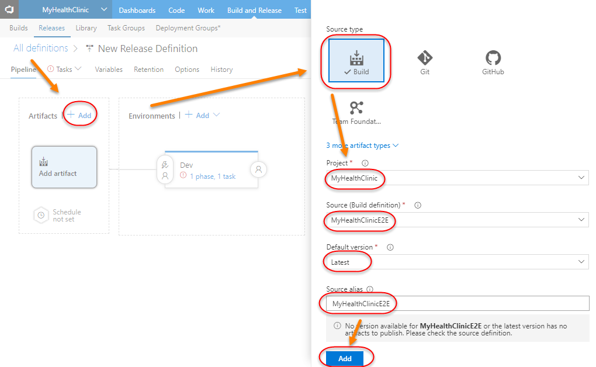 

1. 点击 **1 phase 1 task**，配置Azure App Service部署任务

   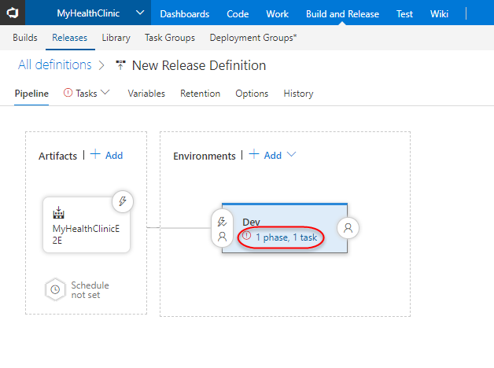 

1. 在**Azure Subscription**中，映射我们在**练习1**中创建的端点。

    

1. 如果您将在Azure上托管WebApp，则将获得必须映射到您的发布定义中的应用程序服务。如果您尚未在Azure上发布，则可以参照 [这份文档](https://almvm.azurewebsites.net/labs/vsts/appservice/) 进行托管。

1. 选择要部署的**MyHealth.Web.zip**文件。

    

1. 我们将替换**appsettings.json**中的数据库连接字符串以指向Azure上的数据库服务器。

   

1. 转到**Variables**选项卡，并使用下面的名称和值创建一个变量。

    

    - 名称: ConnectionStrings.DefaultConnection

    -  值: Server = tcp: {yourdbserver}，1433; Database = myhealthclinic; User ID = {dbuserid}; Password = {dbpassword}; Trusted_Connection = False; Encrypt = True;

1. 为新的发布定义命名并保存发布定义。

   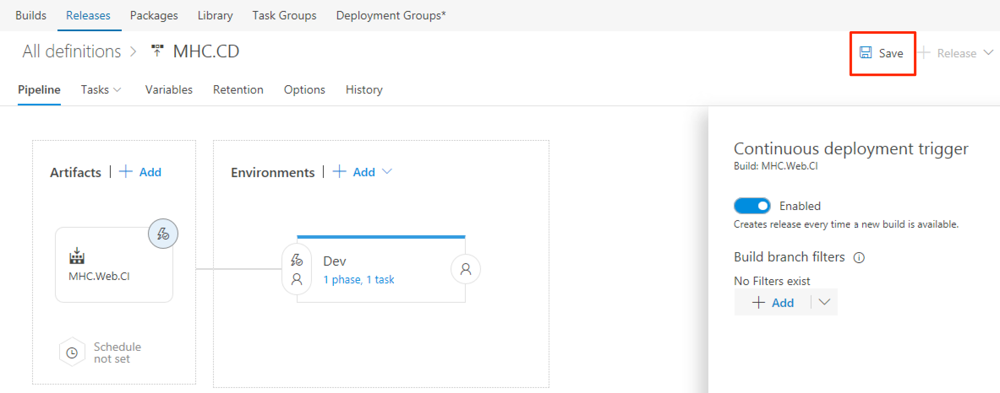 

1. 创建一个**新发布**并选择**latest**版本将其部署到定义中的单个环境中。

    

    

1. 转到发布日志以查看过程。

    

1. 您可以转到Azure门户并获取现有的Web App Service URI。

    

1. 点击**Private Area**登录。

    - 用户名: User
    - 密码: P2ssw0rd@1

    

    

1. 登录后，您应该看到这个仪表板。

    

## 练习3: 管理发布

### 任务1: 触发器

1. 选择发布，然后选择发布定义，然后选择编辑，返回到发布的**管道**视图。

    

    

    

    

   - **Manaul: **当源代码的构建完成后，不会自动触发部署。此发布定义的部署任务需要手动操作才会触发。

   - **After release: **发布管理检测到新的构建工件可用时，会自动触发此发布，执行部署任务。选择此选项时，部署包将从 Artifacts 处配置的相关构建结果中获取

   - **Schedule: **根据配置的时间触发部署任务。当您选择此选项时，您可以使用一组时间相关的控件来选择一周中的某天、某天的某个时间来触发部署任务

   

    
   
1. 在**Pipeline**选项卡中，选择环境任一端的人员图标，以查看和配置部署前和部署后的条件。

    >环境的部署条件显示当前配置的环境部署触发器和部署排队策略。具有编辑版本定义权限的用户可以在此处编辑部署条件。
    请阅读<a href=https://docs.microsoft.com/en-us/vsts/build-release/concepts/definitions/release/triggers>部署触发器文档<a/>。
    
    
    

### 任务2: 工件（Artifacts）

工件是应用程序的可部署组件。团队服务能够在构建期间显式管理工件的内容。

1. 点击发布定义中的**Artifacts**选项卡。

   

   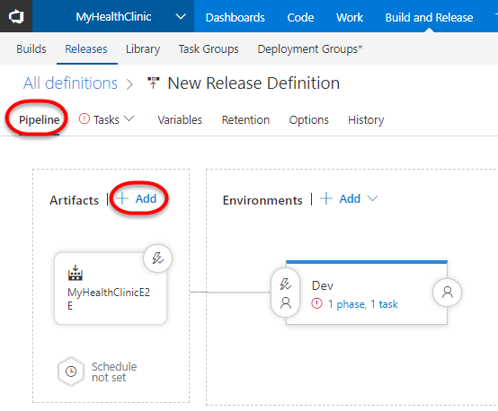 

2.单击上图中的**Add**，并填写所需的详细信息，如下图志示。

     

   - 类型: 指定您引用的构建工件。

   - 项目: 要部署的项目。

   - 构建来源 : 您希望部署的构建定义。选择在持续集成练习中创建的构建。
   - 默认版本: 选择最近的。

   

   

    

### 任务3: 变量

您可以使用默认变量，也可以自行定义变量：

- 在发布定义中变量在所有环境中共享值。当需要在发布定义中的所有环境和任务中使用相同的值时，选择发布定义变量，并且希望能够在单个位置更改值。
- 使用环境变量在一个特定环境中分享所有任务的值。对环境不同的值使用环境级变量(并且对于环境中的所有任务都是相同的) 。
- 以调试模式运行您的部署，以显示可帮助您解决问题和失败的其他信息。

1. 点击发布定义中的**Variables**标签。

   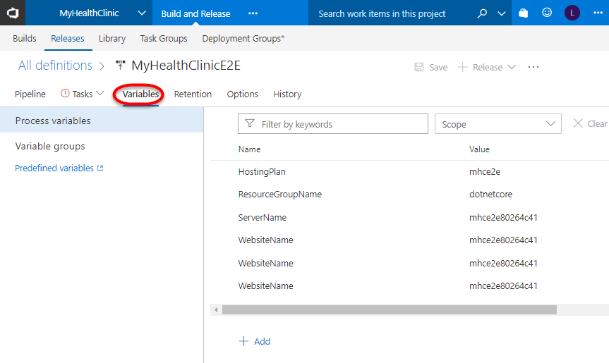 

1. 在发布定义和环境范围中使用变量可帮助您: 

   - 避免重复值，使得更容易将所有事件更新为一个操作。
   - 存储敏感值的方式不能被发布定义的用户看到或更改。

1. 与我们的构建变量类似，我们也可以配置发布变量，并可以在我们的部署过程中使用。

### 任务4: 以调试模式进行发布

在调试模式下，可以在执行整个发布时查看详细的日志信息，或者是查看单个任务的日志信息，这些信息可以帮助我们解决问题，定位部署失败的原因。

1. 从您的发布定义返回**Variables**。

1. 要启动整个发布版的调试模式，请添加一个名为System.Debug的值为true的变量。

   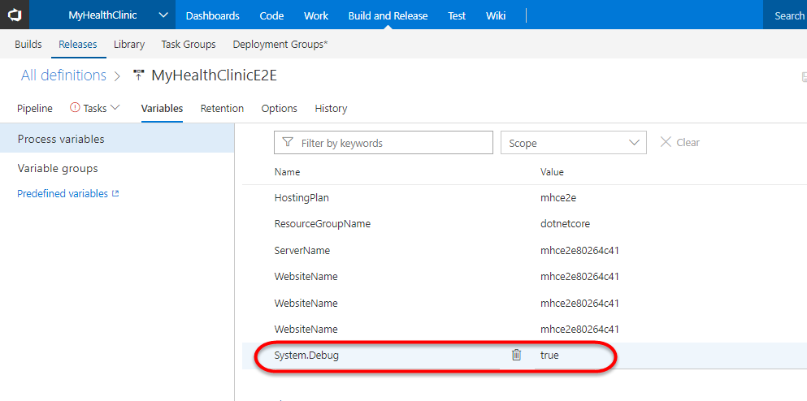 

1. 保存发布定义，将其加入发布队列以检查日志。

### 任务5: 克隆，导出和导入发布定义

1. 从您拥有的发布列表中选择您的发布定义。

    

2.单击**...**打开快捷菜单，然后选择克隆，导出等克隆或导出发布定义。

    

   - **克隆**以旧名称加"复制"为新发布定义名称的完整副本。

   - **导出**以创建一个JSON文件，这其中包含了发布的完整定义。

## 练习4: 环境

发布定义是一组环境。环境是一个逻辑实体，表示您想要部署发布版的位置。从物理上看，环境中的部署可能发生在一系列服务器，云，多个云或应用商店中。使用任务描述环境中的部署步骤。

 

### 任务1: 添加环境

1. 选择您的发布定义，然后单击编辑。

1. 点击**Add**

   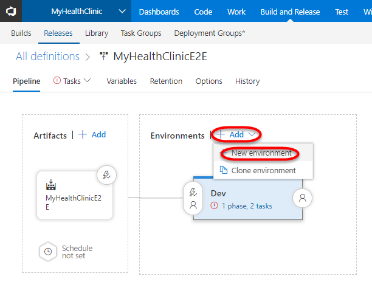 

1. 选择**Azure App Service Deployment**模板,点击 **Apply**。

 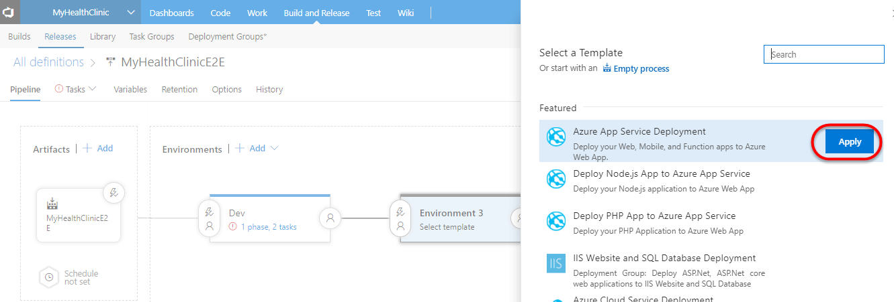 

 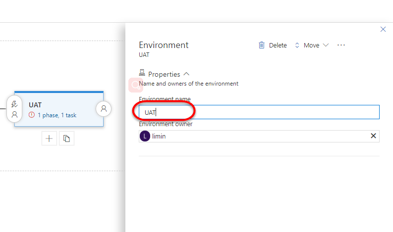 

1. 然后为新环境配置部署前审批，触发器和队列设置。

   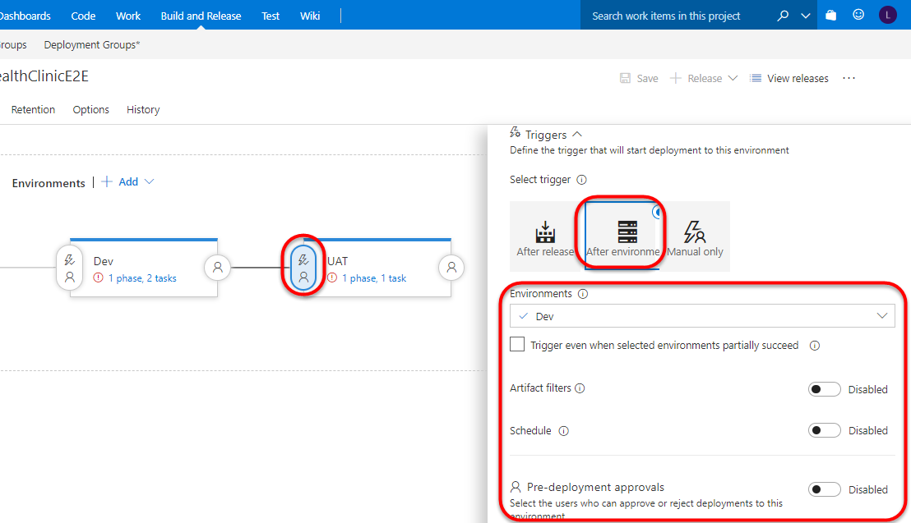 

1. 您可以根据需要为您的实际情况添加其他环境。

### 任务2: 克隆环境

发布定义通常包含多个环境，例如开发，测试，质量保证和生产。通常，所有这些环境基本上都是相似的，每个环境和任务的配置细微差异(例如目标URL，服务路径和服务器名称) 除外，用于设置和部署到每个环境的技术都是相同的， 。

1. 选中现有环境，然后点击 **+Add**

   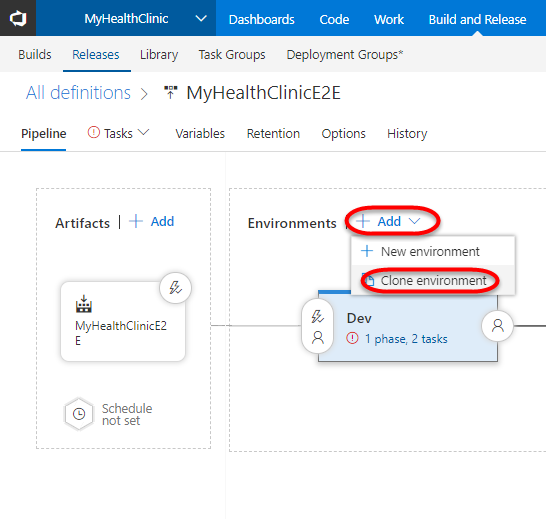 

1. 选中新的环境，然后为新环境配置基本信息，选择预部署审批，触发器和队列设置。

    

    

1. 创建并配置好环境后，可以像前面的步骤中所看到的那样向他们添加任务。

### 任务3: 环境模板

当您开始新的发布定义或将环境添加到现有版本定义时，可以从每个环境的模板列表中进行选择。

这些模板预先使用适当的任务和设置填充环境，这可以大大减少创建发布定义所需的时间和精力。或者，您可以选择以仅包含单个默认空白环境的空白版本定义或不包含任务的空白环境开始。

您也可以从已填充和配置的环境中创建自己的自定义环境模板。

1. 选择现有环境，并在椭圆(...) 上选择**另存为模板**。

   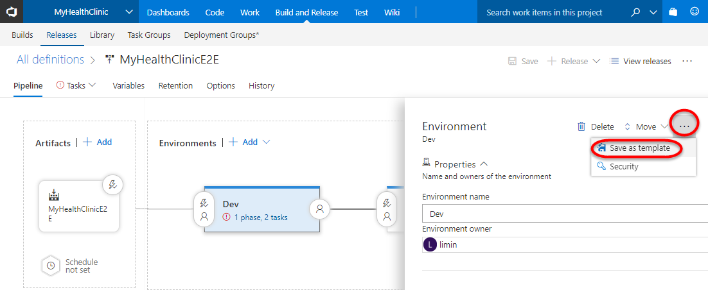 

1. 输入名称，描述并选择确定。

    

1. 创建的自定义模板显示在"创建新的发布定义"对话框的"自定义"选项卡中。

   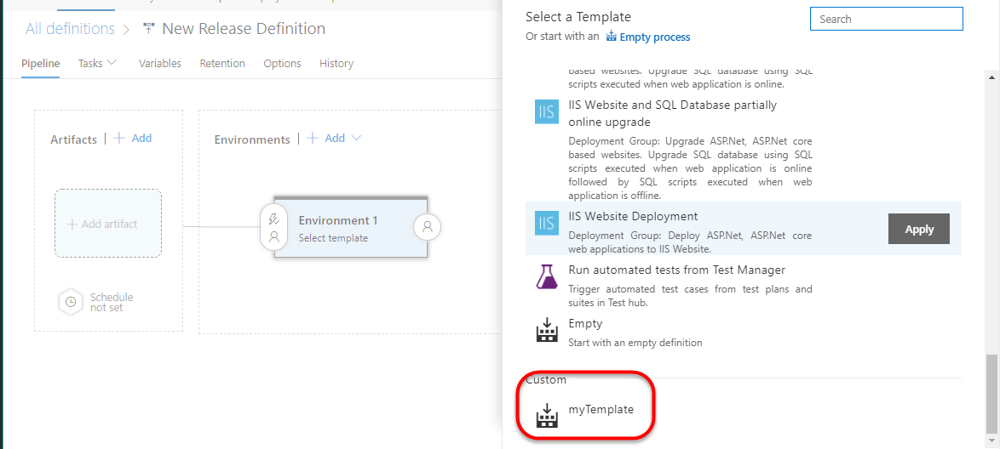 

### 任务4: 审批和审批者

您可以在发布定义中为每个环境定义审批者。从包含审批者的发布定义创建发布时，部署将在需要审批的每个节点上暂停，直到指定审批者审批或拒绝发布(或将审批重新分配给其他用户) 。

1. 选择一个环境，环境左边的图标,在 Pre-Deployment Approvals 处点击 **Enable**。在Approvals处输入审核人名称，可设置多个审批者

   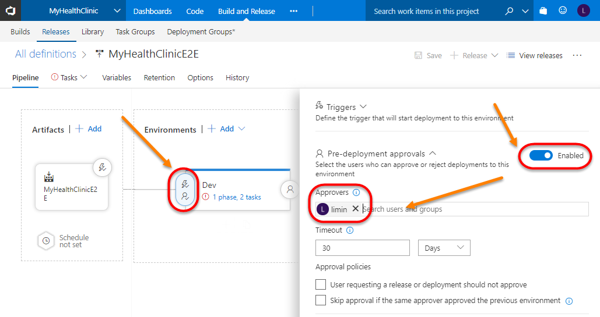 

1. 上图配置的是预先部署审批者，还可以设置部署后审批者。

   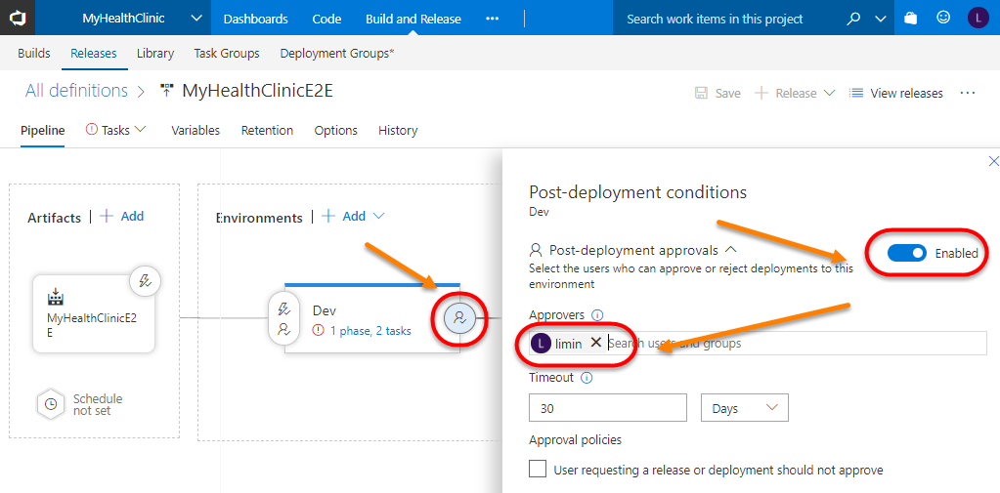 

1. 您可以为部署前和部署后设置添加多个审批者。添加多个审批者时，您还可以控制他们如何审批部署。

   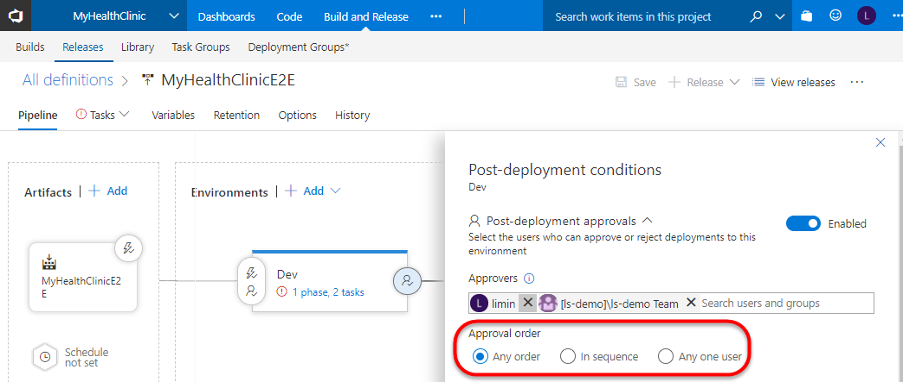 

1. 保存发布定义并执行发布。转到发布定义日志以查看过程。

    

1. 点击**审批或拒绝**。该版本将继续部署在所需的环境中。

    
